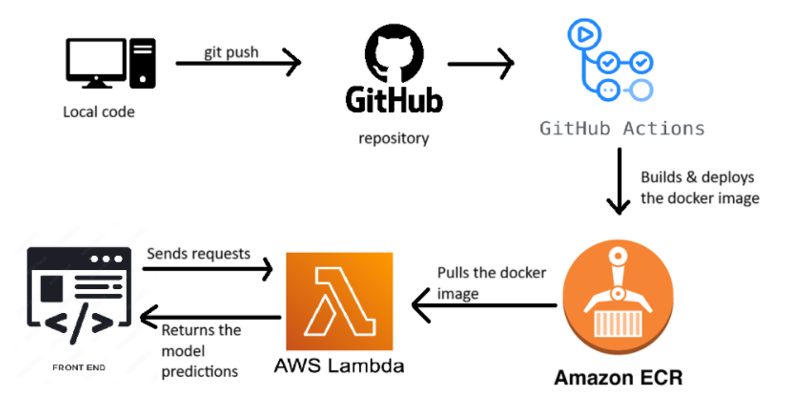
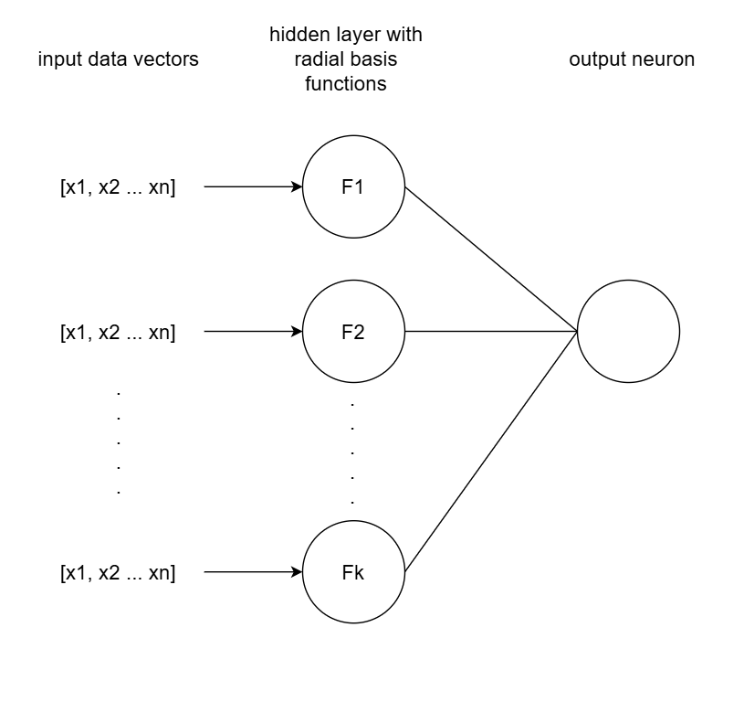
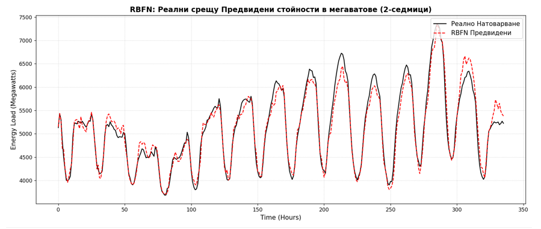

# Custom RBF Neural Network for Power Grid Load Prediction

This project focuses on predicting energy grid loads using a **Radial Basis Function (RBF) Neural Network** built from scratch in Python. The main goal was to implement the mathematical core of the model without relying on high-level ML libraries like TensorFlow or PyTorch.

## Key Features
* **From-Scratch Implementation:** Mathematical modeling of the RBFN architecture (input, hidden RBF layer with centers/widths, and linear output layer).
* **Cloud Native:** The model is containerized and runs as a serverless function on **AWS Lambda**.
* **Automated CI/CD:** Every push to the repository triggers a **GitHub Action** that builds a Docker image and pushes it to **Amazon ECR**, which then updates the Lambda function.

## Architecture & Cloud Flow
To make the model scalable and easy to deploy, I designed the following cloud pipeline:

* **CI/CD:** GitHub Actions
* **Registry:** Amazon ECR
* **Compute:** AWS Lambda (Dockerized)

## Model Overview
The RBF network was chosen for its efficiency in approximating non-linear functions. Unlike standard MLP, the RBF layer uses radial distance to centers to transform the input space.

## Performance Results
The model was tested against historical power grid data. Below is a comparison between the actual load and the model's predictions, showing that the "from scratch" implementation achieves high accuracy.

## Tech Stack
* **Language:** Python (NumPy for math)
* **DevOps:** Docker, GitHub Actions
* **Cloud:** AWS (Lambda, ECR)

To test the model live check the link to the frontend [right here](https://ulianmateev.github.io/rbfn-frontend/) using the sample files provided in the `test_data` folder.
